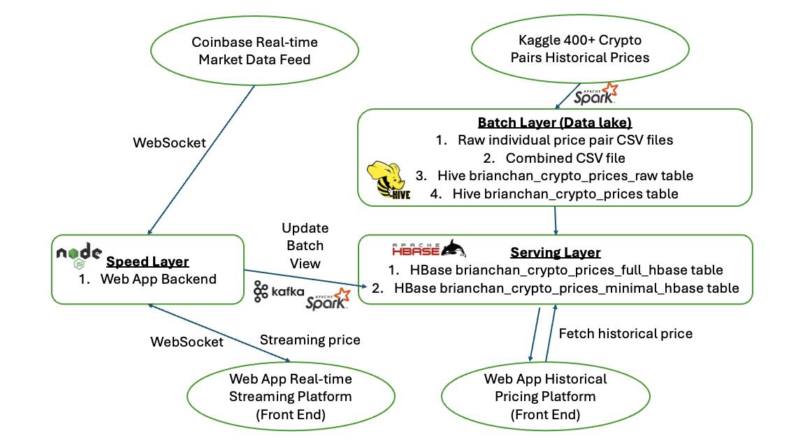
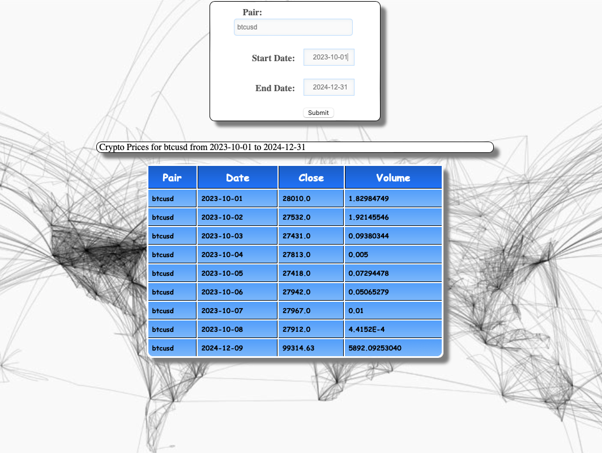
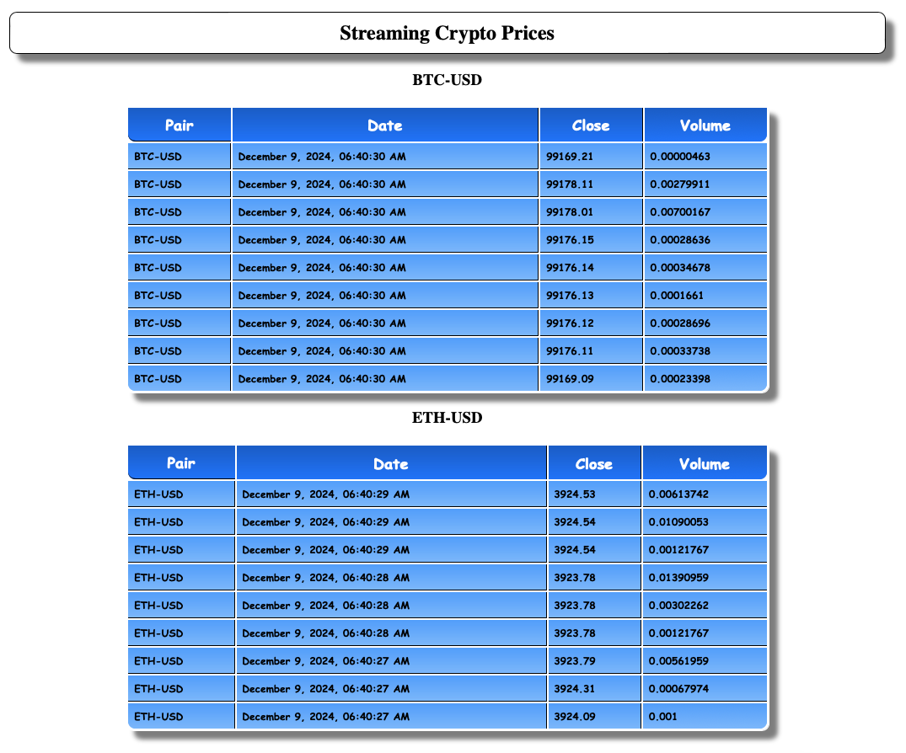

# CoinSight: Big Data Cryptocurrency Pricing Platform

## Project Overview



CoinSight is a big data cryptocurrency pricing platform that provides historical and real-time cryptocurrency prices. The platform consists of two main functionalities: fetching historical cryptocurrency prices and viewing real-time cryptocurrency prices. 

**Quick Demo**: **[CoinSight](https://youtu.be/xWvt8TsN4Bc)**

**Technologies Used:** 
- HDFS
- Hive
- HBase
- Kafka
- Spark
- WebSockets
- Node.js
- Scala/HQL/Java/Python

**Data Size**
- ~ 140 million rows of data in a batch table (400 cryptocurrency pairs prices at 1-minute resolution)
- ~ 430,000 rows of data in a serving table (400 cryptocurrency pairs prices at daily resolution)

**Data Source**
- Historical Crypto Prices: [Kaggle 400+ crypto currency pairs at 1-minute resolution](https://www.kaggle.com/datasets/tencars/392-crypto-currency-pairs-at-minute-resolution)
- Real-Time Crypto Prices: [Coinbase Websocket](https://docs.cdp.coinbase.com/exchange/docs/websocket-overview)

### Historical Cryptocurrency Prices (Batch Layer & Serving Layer)



User can select a cryptocurrency pair from the dropdown option and input the start and end dates to get the historical prices of the selected cryptocurrency pair. 

I first downloaded the historical cryptocurrency pairs zip files from Kaggle and extracted them to HDFS. I used Spark to combine the historical cryptocurrency pairs csv files into a single csv file. I then used Hive/Spark to interpret the CSV file to create a batch layer table. That made up the datalake in the batch layer.

For the serving layer, I used Hive to create a serving layer HBase table. I also created a serving layer HBase table with fewer columns (only those needed now, as the datalake has pricing data up to minute interval but users probably only care about certain columns of the daily price). HBase is a NoSQL distributed big data store that enables users to quickly look for historical prices they care about without having to scan through the entire batch layer table. It is also not recommended to allow users to directly interact with the datalake as it is not optimized for querying and it is our source of truth that we do not want to user to accidentally modify. 

Once the user hits Submit, the web app will send a request to the backend Node.js server, which will then perform an HBase scan to get the historical prices of the selected cryptocurrency pair and render back to the front end.

### Real-Time Cryptocurrency Prices (Speed Layer)



User can view the real-time cryptocurrency prices of the selected cryptocurrency pair, streaming in real-time to their screen. For now, only the real-time prices of the selected cryptocurrency pair (BTC-USD, ETH-USD) are shown, as these are the most popular pairs most users care about.

The data source comes from the Coinbase Websocket. I used Node.js to connect to the Coinbase Websocket to get real-time prices (no authentication required for the data we care about now). Websocket is a bi-directional communication protocol that enables real-time data streaming between the server and the client. Instead of hitting the Coinbase API every second, once WebSocket is connected, it will keep streaming the data to the client side, which is ideal for real-time data streaming, i.e. our use case. We now have a real-time data stream of cryptocurrency prices.

The streaming data from Coinbase goes to two directions, one to the front end, the other to the backend Kafka message queue. To stream data to the front end, I created a websocket server in the Node.js backend to allow the client side (front end) to connect with it to get the real-time streaming data to the screen. Additionally, to update the batch view, I sent the streaming data also to Kafka message queue, which is then consumed by the Spark Kafka consumer to update the data in the serving layer table in HBase. Once this is done, users will be able to see the latest changes in both the real-time streaming view and the historical view on the websites.

## Steps to Build the Project
1. Run data_ingestion.sh to download the historical crypto pairs zip files and extract them to HDFS.
2. Use Spark with combine_csv.scala to combine the historical crypto pairs csv files into a single csv file.
3. Use Hive with build_batch_table.hql or Spark with build_batch_table.scala to create the batch layer table.
4. Use Hive with build_serving_table.hql to create a serving layer table in HBase.
5. Use Hive with build_minimal_serving_table.hql to create a serving layer HBase table with fewer columns (only those needed now).
6. Create web app with the respective front end page (index.html, streaming.html) for the user to view and get the data. index.html is to show historical prices and streaming.html is to show real-time streaming prices. app.js is the server side code to connect HBase, Kafka, connect to Coinbase websocket to get real-time prices, act as server to connect with client side (front end) with another websocket to stream the real-time prices to the front end and also send to Kafka topic. Additionally, it is used to perform HBase scan for user to get the historical prices and render back to the front end.
7. Create Kafka topic to store streaming prices in real-time.
8. Use Spark Kafka to consume the Kafka topic and constantly update the serving layer table in HBase.

## Instructions

### Start the Web App Server
```bash
# Run this in /home/sshuser/brianchan/final_project
node app.js 8889 http://10.0.0.26:8090 $KAFKABROKERS
```

### SSH Tunnel into Web Server
```bash
ssh -i ~/.ssh/id_rsa -C2qTnNf -D 9876 sshuser@hbase-mpcs53014-2024-ssh.azurehdinsight.net
```

### Configure SOCKS Proxy
Configure SOCKS proxy localhost 9876

### Access the Web App & Fetch Historical Crypto Price
Access the web app: http://10.0.0.38:8889

### Access Real-Time Coinbase Crypto Price
Access real-time Coinbase crypto price: http://10.0.0.38:8889/streaming.html

### Check Kafka Topic Content
```bash
kafka-console-consumer.sh --bootstrap-server $KAFKABROKERS --topic brianchan_crypto_topic --from-beginning
```

### Consume Kafka Message Queue and Update Batch View / Speed Layer
```bash
# Uber jar in /home/sshuser/brianchan/speed-layer-stream-price/target
spark-submit --driver-java-options "-Dlog4j.configuration=file:///home/sshuser/ss.log4j.properties" --class StreamPrice uber-speed-layer-stream-price-1.0-SNAPSHOT.jar $KAFKABROKERS
```

### Check HDFS Raw Data
```bash
hdfs dfs -ls /brianchan/downloads/
hdfs dfs -ls /brianchan/datalake/combined_data
hdfs dfs -cat /brianchan/datalake/combined_data/combined_data.csv | head -n 10
hdfs dfs -cat /brianchan/datalake/combined_data.csv | wc -l
```